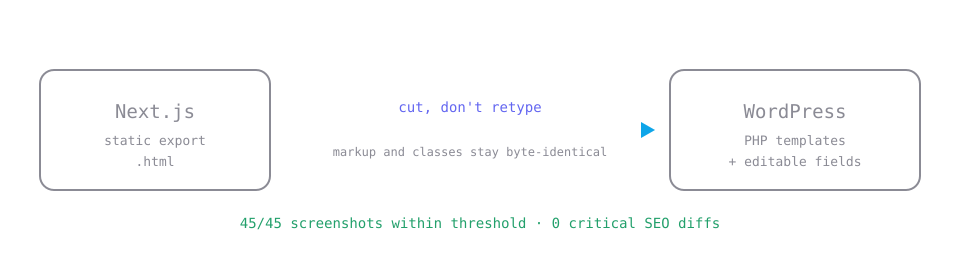
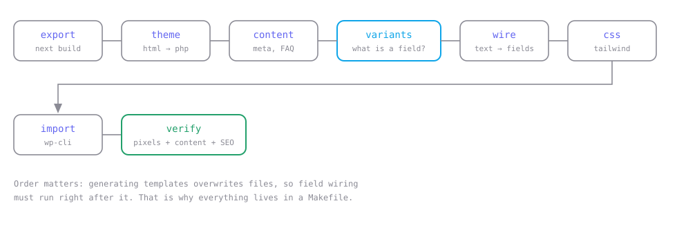
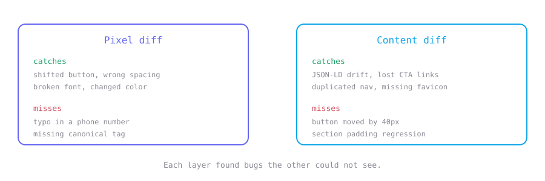

<p align="center">
  
</p>

<h1 align="center">next-to-wp</h1>

<p align="center">
  <strong>Migrate a Next.js site to WordPress without rewriting a single line of markup —<br>
  and prove the result looks identical.</strong>
</p>

<p align="center">
  <a href="#quick-start">Quick start</a> ·
  <a href="docs/METHOD.md">Method</a> ·
  <a href="docs/PITFALLS.md">Pitfalls</a> ·
  <a href="docs/TESTING.md">Testing</a> ·
  <a href="CONTRIBUTING.md">Contributing</a>
</p>

<p align="center">
  
  
  
  
  
</p>

---

## The problem

A client has a site built in Next.js. They want WordPress, so they can edit content
themselves. The site must look **exactly** the same.

The usual answer is to rebuild it by hand in a page builder. That takes days,
and it never comes out pixel-identical.

## The idea

> Don't retype the markup. **Build the static export, then slice the generated HTML
> into PHP templates mechanically**, swap the text for editable fields, and prove
> equivalence with screenshot and SEO diffs instead of eyeballing it.

Tailwind classes and DOM structure are never touched by human hands, so there is
nowhere for a typo to hide. A useful side effect: when the client asks for a change
to the *old* site mid-migration, you don't lose work — you regenerate.

## Results on a real project

A 15-route site with 3 shared templates and ~4,600 lines of TSX:

| | |
|---|---|
| Markup moved automatically | **306 kB**, zero hand-retyping |
| 15 pages became | **10 PHP templates** |
| Visual test | **45/45** screenshots within threshold |
| Content & SEO test | **0** critical diffs |
| Lighthouse | 4 of 5 sampled pages unchanged (100/100) |
| Time | **~2 days** instead of an estimated 7.5 |

The eight remaining visual differences are **bugs in the original that got fixed**,
each documented with a reason — not migration defects.

## Pipeline

<p align="center">
  
</p>

| Step | Tool | What it does |
|---|---|---|
| `export` | `next build` | static HTML — the source of truth for appearance |
| `theme` | `html-to-php.mjs` | HTML → PHP templates, shared header and footer |
| | `extract-fonts.mjs` | fonts **and fallback metrics** straight from the build |
| | `extract-client-only.mjs` | components that only render client-side |
| `content` | `extract-content.mjs` | metadata, FAQs, alt text, CTAs → JSON |
| `variants` | `find-variants.mjs` | **computes which texts should be fields** |
| `wire` | `wire-fields.mjs` | text → field calls, repeated blocks → `foreach` loops |
| `css` | Tailwind CLI | same input file, scans `.php` |
| `import` | `import.php` | idempotent content import over WP-CLI |
| `verify` | `tests/` | pixel diff + content/SEO diff + Lighthouse |

## Three ideas that turned out to matter

### 1. Slice the generated HTML, don't retype it

The static export is what the browser actually renders. Cut it into partials,
replace text with field calls, leave every class alone.

### 2. Compute what should be a field

Three pages sharing a template differ only in content. Comparing their text
sequences yields the exact field list — no guessing:

```
single-product:  14 of 86 texts differ across 3 pages
single-location: 20 of 88 texts differ across 2 pages
```

Those 14 differences *are* your content model.

### 3. Two test layers, because one is never enough

<p align="center">
  
</p>

## Bugs this toolkit caught

Real defects found before launch, that nobody would have noticed by looking:

- **The page rendered blank without JavaScript.** framer-motion writes `opacity:0`
  into the inline `style` attribute, and a static export freezes it there forever.
- **The navigation rendered twice.** Invisible in screenshots — `position: fixed`
  stacks the copies perfectly — but screen readers announced the menu twice.
- **A shared template leaked its source page's parameters**, so a WhatsApp link on
  every product page asked about the wrong product.
- **12 pages were exactly 80px taller** than the original.
- **The favicon was missing** and WordPress silently served its own logo.

Full list with causes and fixes: **[docs/PITFALLS.md](docs/PITFALLS.md)** — 14 entries,
all of them things that actually happened and cost time.

## Quick start

```bash
git clone https://github.com/wiktorj137/nextjs-to-wordpress.git
cd nextjs-to-wordpress
cp migration.config.example.json migration.config.json
cd tools && npm install && cd ../tests && npm install && npx playwright install chromium
```

Fill in `trasy` (export file → template), then:

```bash
cd tools
make theme       # HTML → PHP templates
make variants    # prints which texts differ between pages sharing a template
```

Put those indexes into `mapaPol`, then:

```bash
make wire css import
make verify       # the gate: pixels + content + SEO
```

Full walkthrough: **[docs/METHOD.md](docs/METHOD.md)**

## Project status

**Working, early.** The tools carried one real project end to end. They read a config
file rather than having a project baked in — but they have **not been used on a second
project yet**. Expect rough edges, and please report them.

That is exactly where help is most valuable right now.

## Where this is going

The goal is a program that runs the migration semi-automatically, leaving humans only
the design decisions. See **[docs/ROADMAP.md](docs/ROADMAP.md)** for what is automated,
what is deliberately not, and what is next.

## Contributing

This started as one migration. It gets genuinely useful once it has survived several.

**The single most valuable contribution is running it on your own site and telling us
what broke** — even if you don't fix it. A pitfall report is worth as much as a patch.

Good places to start are listed in **[CONTRIBUTING.md](CONTRIBUTING.md)**, including
a few self-contained tasks that don't require understanding the whole pipeline.

If it saved you time, a ⭐ helps other people find it.

## License

MIT — see [LICENSE](LICENSE).
